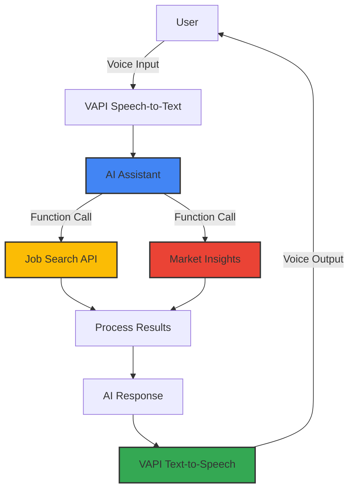

# Career Scout - AI Voice Assistant for Job Search

Career Scout is an AI-powered voice assistant to help the users in their job hunting. It provides Market Trends, Company Specific Jobs and with Job Search thus providing User first experience. It uses real-time tools and APIs to deliver conversational, actionable insights — all via natural voice interaction.


## 🚀 Getting Started

### Prerequisites
- Node.js 18+ and npm/yarn/bun
- Supabase account
- VAPI API key

### Quick Setup
```bash
# Clone repository
git clone https://github.com/yourusername/career-scout.git

# Install dependencies
npm install

# Set up environment variables
cp .env.example .env.local
# Edit .env.local with your API keys

# Run the development server
npm run dev
```

### Environment Variables
```
NEXT_PUBLIC_SUPABASE_URL=your_supabase_url
NEXT_PUBLIC_SUPABASE_ANON_KEY=your_supabase_anon_key
NEXT_PUBLIC_VAPI_PUBLIC_KEY=your_vapi_key
NEXT_PUBLIC_N8N_URL=your_n8n_webhook_url
```

## 🎯 Features

### Voice Interaction with VAPI
- Natural voice conversations using VAPI's STT(Speech to text) and TTS(reverse of STT)
- Voice agent with speaking effect

### Job Search Tools
- For Job Search, it requires 2 parameters from the User, which is then Intelligently parsed via 2 step method. First the Core Model (VAPI) extracts out the content [role(job role), area(location of job)] then it passes these details to n8n Intelligent Engine to proceed forward.
- It utilizes the Web Information from the search query to find Company-specific job listings.
- Provides specific Market insights for a particular roles/industries based out of web-search.

### User Experience
- Multi-step onboarding with GSAP animations
- Dark/light theme toggle
- Secure authentication (email, magic link, Google OAuth)
- Chat history with message types (user, assistant, system, tool)

## 🔄 How It Works



## 🛠️ Tech Stack

- **Frontend**: Next.js 15, React, TailwindCSS
- **Authentication**: Supabase Auth
- **Database**: Supabase PostgreSQL
- **Voice**: VAPI (Speech-to-Text, Text-to-Speech)
- **Animations**: GSAP
- **API Integration**: N8N for workflow automation
- **Deployment**: Vercel

## ✨ Thank you for exploring Career Scout! Happy job hunting!

— Prabhudayal Vaishnav
